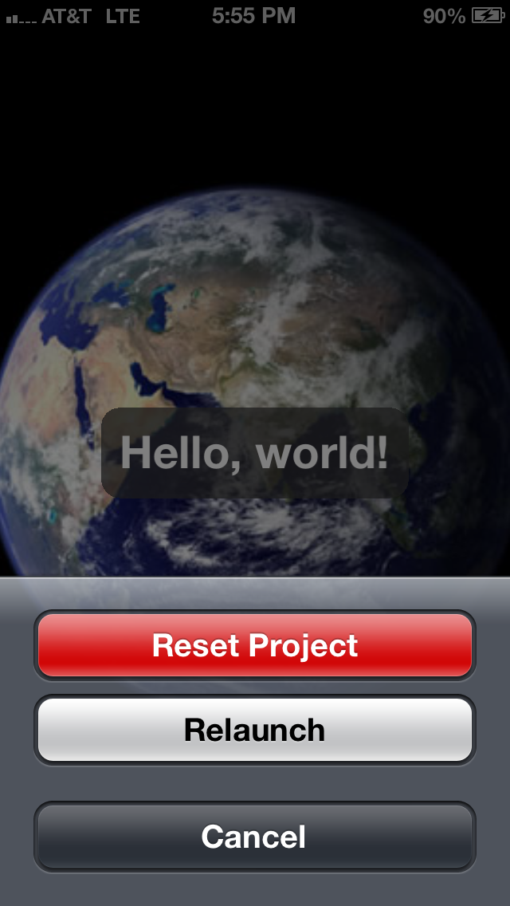

# CoronaViewer (for Corona SDK/Enterprise)

CoronaViewer lets you edit your Corona project on your Mac/Win desktop and preview those code changes in __real-time__ on your __device__.

NOTE: [CoronaCards](http://coronacards.com) developers should go [here](https://github.com/CoronaCards/CoronaViewer).

## Getting Started

### Dropbox Setup

CoronaViewer requires a [Dropbox](https://db.tt/uQgIqtPN) account. You'll also want to install Dropbox on your desktop computer so that you can sync edits from your desktop to the device.

In terms of where your project files, we'll get to that in a second. There will be a special folder that's automatically created __after__ you launch the app and then login to Dropbox from your device.

### Running on device

Build the Corona project in this repo and install it on your device. ([Corona Enterprise](http://coronalabs.com/products/enterprise/) users, see below for additional info.)

### First time launch

If this is the first time you launch the app, you'll be prompted with Dropbox's standard login interface:

Once you've successfully logged in with Dropbox, a special folder will automatically be created on your Mac or Win computer:

	${DROPBOX_FOLDER}/Apps/CoronaViewer

This is where you should copy your Corona project files should go, e.g. `${DROPBOX_FOLDER}/Apps/CoronaViewer/main.lua`.

NOTE: Do not create this folder manually or remove the hidden files created by Dropbox. Only files in this location will be synchronized with your device. The rest of your Dropbox folder is __not__ visible to CoronaViewer.

### Automatic File Updates

The CoronaViewer app will automatically update files based on modification date. When that happens, it will also relaunch your project.

The file update operates by synchronizing files between the device and the special Dropbox folder on your desktop computer. During synchronization, CoronaViewer caches the files locally on the device. Files on the device are only updated the modification date of the incoming file is __newer__ than the version of the file sitting locally on the device.

## CoronaViewer Actions

CoronaViewer has built-in actions that can be triggered by tapping the screen with 4 fingers (i.e. 4 simultaneous touches):

### Relaunch Project

The "Relaunch" action allows you to relaunch your app in CoronaViewer similar to how you relaunch it in the Corona Simulator.

### Reset Project (Switching Projects)

The "Reset Project" action is useful when you are switching projects. In some situations, CoronaViewer may appear to continue to use the files from your previous project instead of the files from your next project, i.e. the files you've just copied into the Dropbox folder on your desktop computer.

This can happen when a file's modification date is older than the version that's on the device, e.g. the `main.lua` from your previous project happened to be newer than the one from your next project.

If this happens, you can inform CoronaViewer to reset the project, thereby bypassing the modification date mechanism described above in 'Automatic File Updates'.

## Gotchas

### `config.lua` and `build.settings`

When running CoronaViewer, the `config.lua` and `build.settings` in your project (i.e. the files you copy into the special Dropbox folder) will __not__ be honored.

Instead, you need to modify `config.lua` and/or `build.settings` in __this__ CoronaViewer project and then rebuild CoronaViewer so your changes take effect.

## Xcode Simulator

CoronaViewer also works in the Xcode Simulator. You simply build CoronaViewer for Xcode Simulator instead of for your device.

## Corona Enterprise

If you are using Enterprise, you will need to add `libplugin_viewer.a`. This plugin is available from the Enterprise [daily builds](http://developer.coronalabs.com/downloads/daily-builds) page (click on the "Enterprise" tab).

This library should appear in the "Link Binary with Libraries" build phase of your app's Xcode project.

### iOS

#### Info.plist

On Enterprise, if you have overridden the `CFBundleURLTypes` array in your Info.plist, then you need to make sure that a `CFBundleURLSchemes` entry exists. It should correspond to the one in [build.settings](build.settings).

## Limitations

### config.lua and build.settings

CoronaViewer uses the [config.lua](config.lua) and [build.settings](build.settings) files in this project, not the one in the project you are viewing (i.e. `${DROPBOX_FOLDER}/Apps/CoronaViewer`). Therefore, you will need to modify `config.lua` and `build.settings` if your settings differ. These include:

* content width
* content height
* content scale
* frame rate
* orientation (default and supported)

### File updates

Files are updated based on modification time and file size. To get the device to update the file, you must make sure the modification time is newer and the file size if different.

Note: There may be a problem if you swap out project files and the "new" project contains `main.lua` and other files with the same name but with an older modification date. 

### Gotchas

Runtime errors during the first pass of main.lua will cause the display to show a black screen.

Only one project can reside in the `CoronaViewer` folder. You need to switch out all the files (except for the hidden Dropbox files) in the folder when changing projects.

## Availability

### Supported Platforms

* iOS
* Android (TBD)

### Product Tiers

CoronaViewer is available to the following subscriptions/tiers:

* __Corona SDK (Pro)__
* __Corona Enterprise__
* __CoronaCards__ uses a slightly different workflow. [Learn more](https://github.com/coronacards/CoronaViewer)

